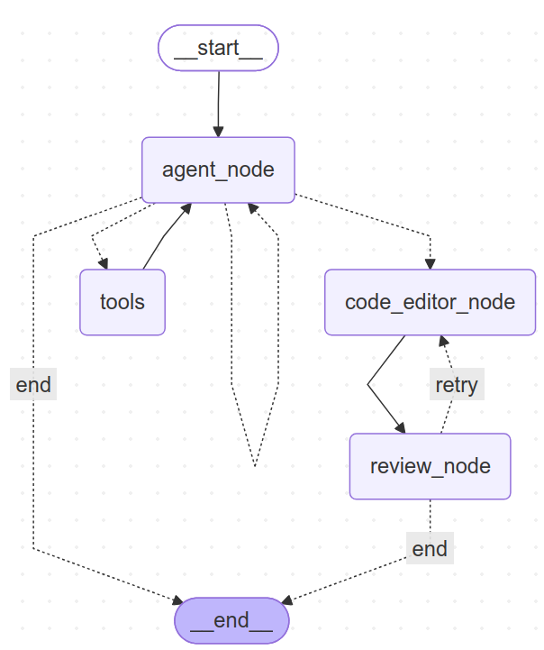

#### Em 2026-1

**Empresa**: DomRock
<br>
**Área de atuação**: Inteligência Artificial

#### Problema: 
No contexto corporativo, regras de negócio raramente permanecem estáticas. Elas são continuamente ajustadas em resposta a novas demandas do mercado, como alterações de precificação, lançamento ou retirada de produtos, reestruturação de acordos comerciais e revisões em políticas de vendas e parcerias.
Essa natureza dinâmica, quando não acompanhada de um registro adequado e organizado, resulta em fragilidades operacionais: inconsistências na execução dos processos, divergências entre os critérios adotados por diferentes colaboradores, dependência de conhecimento não documentado e comprometimento da rastreabilidade das decisões tomadas.
#### Solução:
Foi desenvolvida uma aplicação web voltada ao gerenciamento de regras de negócio. O sistema centraliza informações de lojas, marcas e funcionários, permitindo que o usuário crie novas regras por meio de linguagem natural. Esse processo consiste no envio da solicitação do usuário para uma API desenvolvida em Python com LangGraph, onde o agente de IA realiza o processamento e retorna a regra de negócio estruturada.
Cada regra criada é vinculada a uma loja, marca ou funcionário, e o cálculo de comissão passa a ser realizado com base nessa nova regra. Ao final do cálculo, são exibidas as regras utilizadas no processo, garantindo transparência na apuração dos valores.
Além disso, foi implementada a observabilidade do agente de IA por meio do MLflow, possibilitando o monitoramento da quantidade de tokens consumidos a cada interação com os modelos de linguagem, a avaliação da qualidade das respostas geradas, o versionamento de prompts e o controle de erros.


##### [Repositório](https://github.com/Phoenix-Team-Fatec/API_6)

| **Tecnologia** | **Funcionalidade** |
| :------------- | :----------------- |
| **Vue.js** | Framework JavaScript utilizado no desenvolvimento do frontend da aplicação, permitindo a criação de interfaces dinâmicas e componentizadas. |
| **Python** | Linguagem de programação utilizada no desenvolvimento do agente de IA, escolhida pela ampla compatibilidade com bibliotecas de inteligência artificial e processamento de linguagem natural. |
| **Node.js** | Ambiente de execução JavaScript multiplataforma, utilizado para executar o código do servidor e suportar a aplicação web. |
| **MongoDB** | Banco de dados não relacional (NoSQL), utilizado para o armazenamento de dados relacionados a funcionários, lojas, marcas e regras de negócio. |
| **FastAPI** | Framework Python utilizado para a criação da API RESTful, responsável pela comunicação entre o backend e o agente de IA. |
| **Docker** | Ferramenta utilizada para a conteinerização e o deploy da aplicação, garantindo a padronização do ambiente de execução. |
| **Java** | Linguagem de programação utilizada no desenvolvimento do backend, responsável pela implementação das regras de negócio e pela lógica de integração entre os módulos do sistema. |
| **Spring Boot** | Framework Java utilizado para a construção da API REST, facilitando a configuração e a estruturação dos serviços do backend. |
| **MLflow** | Plataforma utilizada para o versionamento de modelos e a observabilidade do agente de IA, permitindo o rastreamento de experimentos e métricas de desempenho. |
| **LangGraph** | Biblioteca utilizada para a orquestração do fluxo de execução do agente de IA, estruturando suas etapas em formato de grafo. |
| **LangChain** | Biblioteca utilizada para a integração do agente de IA com modelos de linguagem e ferramentas externas, viabilizando o processamento de linguagem natural. |
| **Git** | Sistema de controle de versão distribuído, utilizado para o gerenciamento do código-fonte e a colaboração entre os membros da equipe. |
## Contribuições Pessoais
*Atuando como desenvolvedor, fui responsável pela criação de um submódulo Git destinado a isolar o repositório do agente de IA, seguido da configuração inicial do ambiente de desenvolvimento, incluindo a criação de um ambiente virtual com o uv e a instalação das bibliotecas necessárias para a construção do agente.*
<br>

*Também realizei a criação dos embeddings e do banco de dados vetorial, estruturado em duas coleções: uma contendo os dados e as regras de negócio fornecidas pela empresa parceira, e outra com o código-base desenvolvido para o cálculo de comissão. Para a geração dos embeddings, utilizei o modelo nomic-embed-text:latest, executado por meio do Ollama. Além disso, desenvolvi o retriever, componente responsável por recuperar informações do banco vetorial com base na consulta do usuário, constituindo assim o módulo de RAG (Retrieval-Augmented Generation) do agente.*

<br>

*Realizei a integração com as APIs do Google, da Hugging Face e da Groq para utilização dos seguintes modelos de linguagem: Qwen3-Coder-30B-A3B-Instruct (Hugging Face), Gemini 2.0 Flash Preview (Google) e Meta-Llama/Llama-4-Scout-17B-16E-Instruct (Groq). Com esses modelos, utilizando o LangGraph, construí um grafo composto por três nós: Agent Node, Code Editor e Review Node. O fluxo tem como objetivo gerar um objeto JSON que será utilizado para calcular as novas comissões.*

### Agent Node 
*Responsável por orquestrar o fluxo do agente. Com base na consulta do usuário, aciona ferramentas (tools) para buscar informações no banco de dados vetorial. Para evitar chamadas excessivas, foi implementado um guardrail que limita o número de requisições a no máximo dez. Quando as informações necessárias para contextualizar a criação do JSON são obtidas, o fluxo avança para o nó Code Editor. Os modelos utilizados neste nó são o Gemini 2.0 Flash Preview e o Meta-Llama/Llama-4-Scout.*

### Code Editor
*Utiliza o Qwen3-Coder-30B-A3B-Instruct como modelo de linguagem e é responsável por gerar o objeto JSON para o cálculo da comissão, seguindo um esquema pré-estabelecido que orienta o modelo na construção correta do objeto. Dois tipos de objeto podem ser gerados: Override, quando a solicitação altera percentuais de comissão por marca ou cargo (por exemplo, "Aumente a comissão da loja 22 em 10%"), e Intercorrência, quando a solicitação concede bônus ou ajustes a matrículas individuais (por exemplo, "Funcionário 10 recebe bônus de R$500"). Após a criação do objeto, o fluxo avança para o Review Node.*
#### Exemplo de esquema pré estabelecido
```python
class IntercorrenciaSazonal(BaseModel):
    """Bônus ou ajuste sazonal vinculado a matrículas individuais."""

    matricula: str = Field(description="Matrícula do funcionário")
    tipo: Literal["bonus_fixo", "bonus_venda", "admissao_bonus", "perc_bonus"] = Field(
        description="Tipo da intercorrência conforme calcular_comissionamento()"
    )
    valor: float = Field(description="Valor em reais ou percentual conforme o tipo")
    vigencia_inicio: date = Field(description="Início da vigência")
    vigencia_fim: date = Field(description="Fim da vigência (inclusive)")

    @model_validator(mode="after")
    def validar_periodo(self) -> IntercorrenciaSazonal:
        if self.vigencia_fim < self.vigencia_inicio:
            raise ValueError(
                f"vigencia_fim ({self.vigencia_fim}) não pode ser anterior "
                f"a vigencia_inicio ({self.vigencia_inicio})"
            )
        return self

    def esta_vigente(self, ano: int, mes: int) -> bool:
        primeiro_dia_mes = date(ano, mes, 1)
        ultimo_dia_mes = date(ano, mes, calendar.monthrange(ano, mes)[1])
        return self.vigencia_inicio <= ultimo_dia_mes and self.vigencia_fim >= primeiro_dia_mes
```

#### Exemplo de corpo de resposta do objeto 
##### Override
```javascript
{
  "tipo": "override",
  "justificativa": "<qual regra foi aplicada e por quê>",
  "override": {
    "descricao": "<texto legível>",
    "data_inicio": "YYYY-MM-DD",
    "data_fim": "YYYY-MM-DD",
    "perc_override": {"cod_marca,cod_cargo": percentual},
    "marca_override": {"cod_marca_origem": cod_marca_referencia},
    "perc_adicional": {"cod_marca,cod_cargo": valor_decimal}
  },
  "intercorrencias": null
} 
```
##### Intercorrência
```javascript
{
  "tipo": "intercorrencia",
  "justificativa": "<qual regra foi aplicada e por quê>",
  "override": null,
  "intercorrencias": [
    {
      "matricula": "MATRIC-XXX",
      "tipo": "bonus_fixo",
      "valor": 500.0,
      "vigencia_inicio": "YYYY-MM-DD",
      "vigencia_fim": "YYYY-MM-DD"
    }
  ]
}
```

### Review Node
*Tem como objetivo verificar se o objeto JSON foi gerado corretamente conforme o esquema esperado, além de validar a regra de negócio quanto a erros e possíveis inconsistências. Caso o objeto esteja fora do padrão, o fluxo retorna ao Code Editor, repetindo o processo por no máximo dez iterações até que o JSON seja gerado adequadamente.*

<br>

### Fluxo Constrúido


<br>

*Por fim, utilizando o MLflow, implementei a observabilidade do agente de IA, monitorando a quantidade de tokens consumidos em cada iteração do fluxo, a ocorrência de erros, o versionamento de prompts e a qualidade das respostas geradas pelo agente.*


## Hard Skills
| Tecnologia     | Proficiência       | Descrição                                                                                                               |
| :------------- | :----------------- | :---------------------------------------------------------------------------------------------------------------------- |
| **LangChain**  | faço com autonomia | Desenvolvimento de página ecomponentes, além da integração com backend |
| **LangGraph**  | faço com autonomia | Desenvolvimento de página ecomponentes, além da integração com backend |
| **Python**     | faço com autonomia | Desenvolvimento do agente de IA |
| **MLFlow**     | faço com autonomia | Integração do agente de IA com modelos de linguagem e ferramentas externas, viabilizando o processamento de linguagem natural.|
| **Git**        | faço com autonomia | Controle de versão, trabalho em equipe com branches e gestão de repositórios.|


## Soft Skills
-  **Pensamento analítico** *Pensamento analítico: Após a entrega da primeira sprint, analisei o comportamento do agente de IA e identifiquei uma limitação estrutural: até aquele momento, o agente operava de forma linear, executando etapas fixas e sequenciais, sem capacidade de adaptar seu fluxo conforme o contexto da solicitação. A partir dessa avaliação, concluí que a arquitetura baseada no LangChain não atenderia às necessidades de um agente mais iterativo e com maior capacidade de raciocínio. Com essa análise fundamentada, propus durante a sprint planning a migração do núcleo do agente para o LangGraph, que possibilita a construção de grafos com fluxos condicionais e iterativos. Essa mudança resultou em um agente mais robusto, capaz de tomar decisões dinâmicas ao longo de sua execução.*


- **Proatividade**: *Diante da necessidade de monitoramento do agente de IA, tomei a iniciativa de pesquisar e implementar a observabilidade do sistema antes mesmo da definição formal dessa tarefa pela equipe. Realizei estudos sobre ferramentas de rastreamento de modelos de linguagem e, com base nisso, dei início à integração do MLflow ao projeto, configurando o monitoramento de tokens consumidos, o versionamento de prompts e o registro de métricas de qualidade das respostas. Essa ação antecipada permitiu que a equipe dispusesse de uma estrutura de observabilidade funcional desde as primeiras iterações do agente, facilitando a identificação de falhas e a otimização contínua do fluxo.*
 

[Voltar](../README.md)